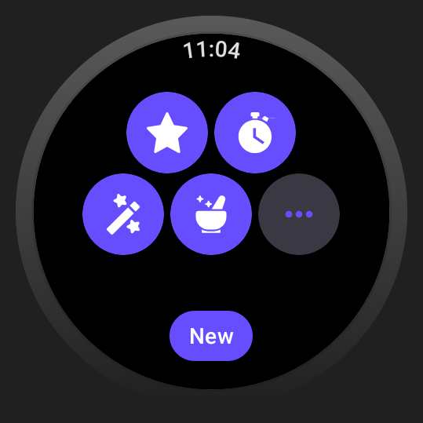
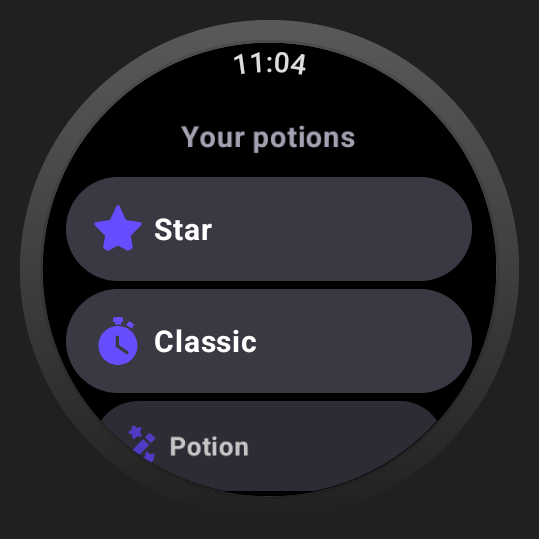
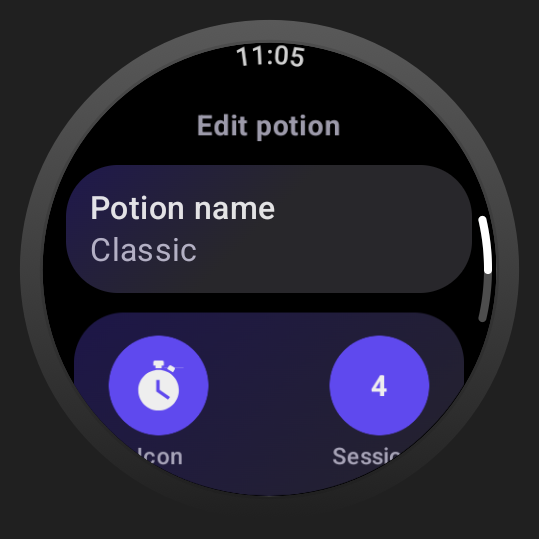
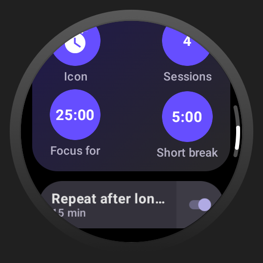
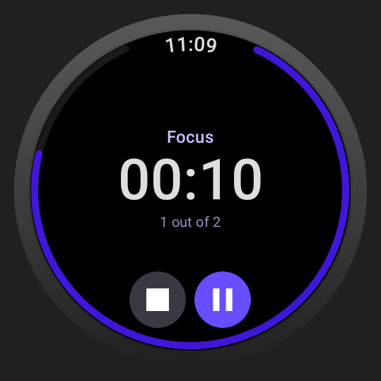
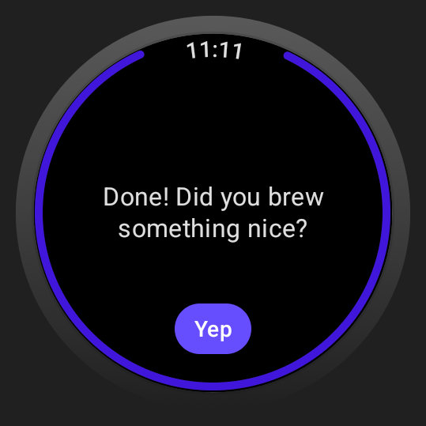

# Focus Potion

A simple and stylish pomodoro timer on your wrist

  
  
  

  
  
  

### Features

- Standalone & local - no connection to the phone or internet needed
- Create your own custom pomodoro timer with abundant settings and fun icons
- Working in background with complication available - use any other app as needed without interrupting the timer
- Build with care for battery usage<3

#### To be added:

- Tile for quick access
- End-of-the-round vibration for better usability

### Technologies

- Written in Kotlin
- Build via Gradle Kotlin DSL
- UI in Material 2.5 via Jetpack Compose for Wear OS, Horologist & ProtoLayout
- Navigation via Jetpack Compose (cr. to Jeo Birch and
  his [article](https://joebirch.co/android/modular-navigation-with-jetpack-compose/) for the idea)
- DI via Hilt
- Local data storage with DataStore
- Coroutines<3
- Build with combined MVVM/MVI architecture for easy further migration

### Copyright

Copyright 2024 Evgeniya Zemlyanaya.
Licensed under the Apache License, Version 2.0; see [LICENSE.md](LICENSE.md) for full conditions.